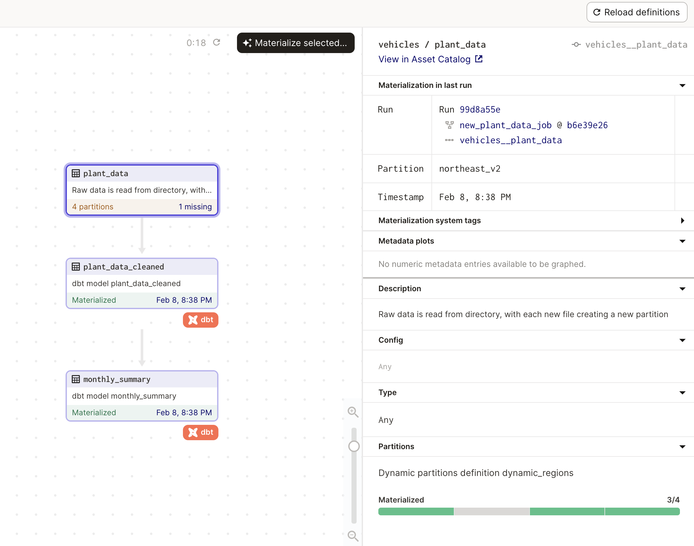
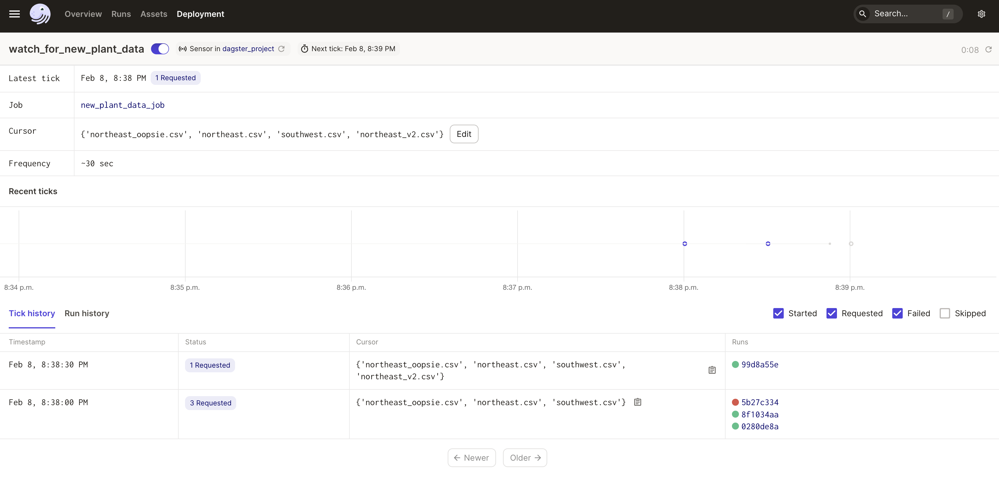
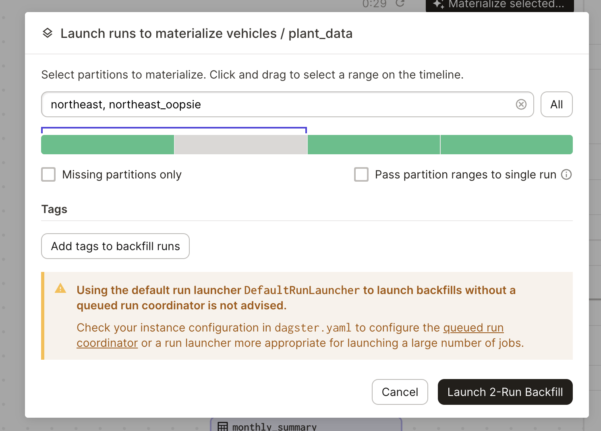

 
This project demonstrates an ELT pipeline:

1. Data files live in the `/data` directory 

2. Each files is processed and loaded a partition of the asset `plant_data` and loaded into a corresponding warehouse table called `plant_data`. 

3. The raw data is then summarized using 2 dbt models. These two summary tables are re-created for any update to the plant data table so they always have the latest data incorporating all of the partitions.

The entire data platform, including the state of each partition is easily viewable in the global asset graph:



The files can be processed automatically using a Dagster sensor. The first time the sensor is turned on it will process all existing files. As new files are added to the data directory, the sensor will launch runs to process the new files:



The files can be processed manually using a Dagster backfill:




## Experimental Features

### Dynamic Partitions

This project uses dynamic partitions. New files can arrive in the data folder and partitions will be created for them on-the-fly. This capability is experimental as of Dagster 1.1.18. 

### Pydantic Resources

This project uses a new way to create and configure Dagster resources, experimentally released in Dagster 1.1.17.

### Limitations

As a result of these two experimental capabilites, the project uses a poor man's IO manager to handle writing the extracted data to a DuckDB warehouse. In the future, the `dagster-duckdb` package will provide an IO manager that supports dynamic partitions and Pydantic-style configuration.

## Getting Started 

Run: 

```bash
pip install -e ".[dev]"
dagster dev
```

Navigate to "Overview" > "Sensors" and turn on the sensor. The sensor will start 3 runs, one for each file in the `data` directory. One of those runs will fail. Next, copy the file `northeast_v2.csv` into the `data` directory. The sensor will launch a new run for this new partition.


